# Simple Linear Regression

Simple linear regression assumes that there is approximately a linear relationship between *X* and *Y*. It's written as

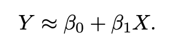

It's essentially just a fancy way of saying `y = mx + b`.

Let's skip some stuff cuz it's pretty simple and get to the relevant notes.

## Estimating the Coefficients

In practice, `B0` and `B1` are unknown. So before we can use the above equation to make predictions, we must use data to estimate the coefficients. Let

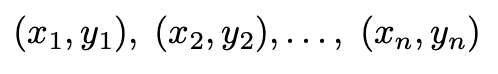

represent `n` observation pairs, each of which consists of a measurement of `X` and `Y`. Our goal is to obtain coefficient estimates of `Bhat0` and `Bhat1` such that the linear model fits the available data well.

There are many ways to measure *closeness*. However, the most common approach involves minimizing the **least squares** criterion.

Let

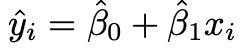

be the prediction for `Y` based on the `i`th value of `X`. Then

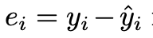

represents the `i`th **residual**. This is the difference between the `i`th observed response value and the `i`th response value that is predicted by our linear model. We can define the **residual sum of squares (RSS)** as

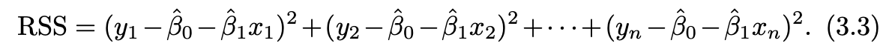

We use `Bhat0` and `Bhat1` to minimize the RSS. Here's what it looks like when plotted:

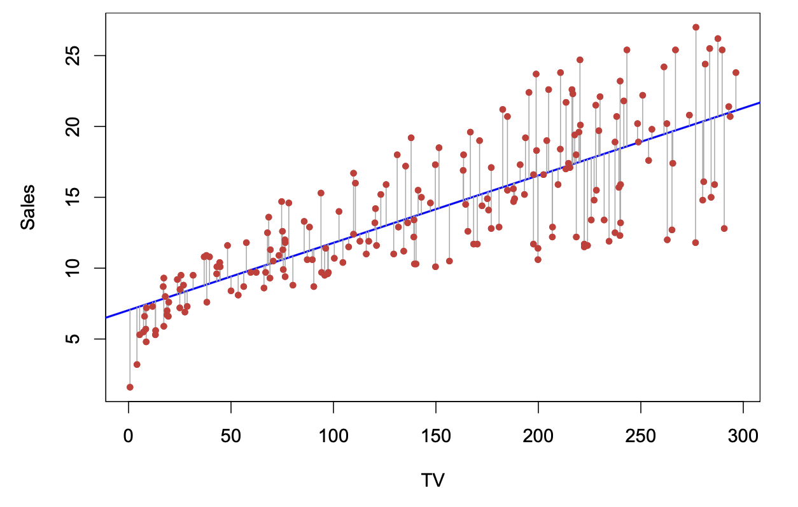

The minimization here **defines the least squares coefficient estimates for simple linear regression**.

## Assessing the Accuracy of the Coefficient Estimates

### Standard Error

The standard error asks how accurate is the sample mean `u_hat` as an estimate of `u`. 

How far off will that single estimate of `u_hat` be? In general, we answer this question by computing the **standard error* of `u_hat`. **Roughly speaking, the standard error tells us the average amount that this estimate `u_hat` differs from the actual value of `u`**

Additionally, standard deviation shrinks with `n`-the more observations we have, the smaller the standard error of `u_hat`. Note that we can also compute the standard errors that describe how close `Bhat0` and `Bhat1` are to the true values `B0` and `B1`.

Moreover, we also have the **residual standard error**, which is the estimation of `std**2`.

Standard errors can be used to compute **confidence intervals**. A 95% confidence interval is defined as a range of values such that with 95% probability, the range will contain the true unknown value of the parameter.

Standard errors can also be used to perform **hypothesis tests** on the coefficients. The most common hypothesis test involves testing the **null hypothesis** of:
* `H0`: There is no relationship between `X` and `Y`
* `Ha`: There is some relationship between `X` and `Y`

### t statistic and p-value

We also use the **t statistic**, which measures the number of standard deviations the `Bhat1` is away from 0. Essentially, it tests if the null hypothesis = 0, meaning there is no relationship between `X` and `Y`. Consequently, it's a simple matter to compute the probability of observing any number equal to |t| or larger in absolute value, assuming `B1` = 0. We call this probability the **p-value**.

Roughly speaking, we interpret the p-value as follows: **a small p-value indicates that it's unlikely to observe such a substantial association between the predictor and the response due to change, in the absence of any real association between the predictor and the response**.

Hence, if we see a small p-value, then we can infer that there is an association between the predictor and the response. We *reject the null hypothesis*-that is, we declare a relationship to exist between `X` and `Y`.

Typical p-value cutoffs for rejecting the null hypothesis are 5% or 1%. When `n` = 30, these correspond to t-statistics of around 2 and 2.75, respectively.

## Assessing the Accuracy of the Model

Once we've rejected the null hypothesi, it's natural to want to quantify the extent to which the model fits the data. We can do this with two *typical* approaches: the **residual standard error (RSE)** and the R**2 statistic.

### Residual Standard Error

The RSE is an estimate of the standard deviation of the error term *e*. Roughly speaking, it's the average amount that the response will deviate from the tru regression line. 

In other words, **the RSE is considered a measure to the lack of fit of the model to the data**. A small RSE indicates that the model fits well, while a large one indicates that the model doesn't fit well.

### R squared statistic

The RSE provides an absolute measure of lack of fit of the model to the data. But since it's measured in units of `Y`, it's not always clear what constituted a good RSE.

**The R squared statistic provides an alternative measure of fit. It takes the form of a *proportion*-the proportion of variance explained**. It always takes on a value between 0 and 1, and is independent of the scale of `Y`.

The R squared statistic's formula involves the usage of the **total sum of squares (TSS)**. TSS measures the total variance in the response `Y`, and **can be thought of as the amount of variability inherent in the response before the regression is performed**. In contrast, RSS measures the amount of variability that is left unexplained after performing the regression.

An R squared stat that is close to 1 indicates that a large proportion of the variability in the response is explained by the regression. A number near 0 indicates that the regression does not explain much of the variability in the response. This might occur because the linear model is wrong, or the error variance`std**2` is high, or both.
# Multiple Linear Regression

Simple linear regression is a useful approach for predicting the response on the basis of a single predictor variable. However, in practice we often have more than one predictor. How can we extend out analysis of data in order to accommodate for additional predictors?

One option is to run separate linear regressions, each of which uses a different variable as a predictor.

However, the approach of fitting a separate simple linear regression model for each predictor is not entirely satisfactory. First of all (in the instance of the advertising data), it's unclear how to make a single prediction of sales given the three advertising media budgets, since each of the budgets is associated with a separate regression equation. Second, each of the three regression equations ignores the other two media in forming estimates for the regression coefficients. If the media budgets are correlated with each other in the 200 markets in our data set, then this can lead to very misleading estimates of the association between each media budget and sales.

Instead of fitting a simple linear regression model for each predictor, a better approach is to extend the simple linear regression model into the weighted formula you've already encountered:

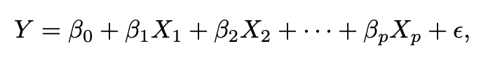

Where `Xj` represents the jth predictor and `Bj` quantifies the association between that variable and the response.

## Estimating the Regression Coefficients

As was the case in the simple linear regression setting, the regression coefficients `B0`, `B1`,...,`Bp` are unknown, and must be estimated. We revise the formula to the above one with weights and replace the `B` values with `Bhat` values.

The parameters are estimated using the same least squares approach as in simple linear regression. The values `Bhat0`... `Bhat_p` are the multiple least squares regression coefficient estimates.

Unlike the simple linear regression estimates, the multiple regression coefficient estimates have somewhat complicated forms that are represented using matrix algebra. For this reason, the textbook doesn't provide them.

Here's a graph the illustrate an example of the least squares fit:

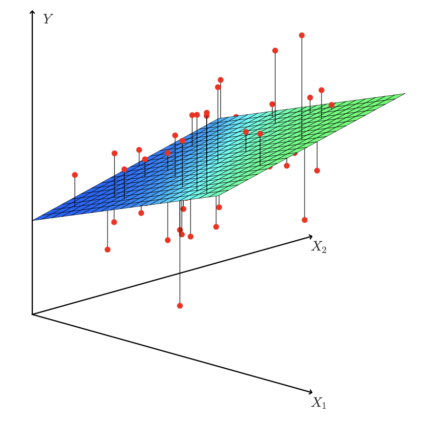

*In a three-dimensional setting, with two predictors and one response, the least squares regression line becomes a plane. The plane is chosen to minimize the sum of the squared vertical distances between each observation (shown in red) and the plane.*

Moreover, this graph displays the multiple regression coefficient estimates when TV, radio, and newspaper advertising budgets are used to predict product sales using the `Advertising` data.

The simple and multiple regression coefficients can be quite different (obviously). This difference stems from the fact that in the simple regression case, the slope term represents a single feature, such as newspaper, in its relation to how it increases sales. By contrast, in the multiple regression setting, the coefficient for `newspaper` represents the average increase in product sales associated with increasing newspaper spending by $1,000 while holding `TV` and `radio` fixed.
## Some Important Questions

### Is There a Relationship Between the Response and Predictors?

Recall that in the simple linear regression setting, in order to determine
whether there is a relationship between the response and the predictor we
can simply check whether β1 = 0.

When considering multiple linear regression, this leads to extending the null hypothesis asking if there is no relation amongst all `B` values. **The alternative asks if at least one `Bj` is non-zero**.

This hypothesis test is performed by computing the **F-statistic**. When there is no relationship between the response and predictors, one would expect the F-statistic to take on a value close to 1. On the other hand, **if the alternative hypothesis is true, then we expect F to be greater than one**.

The answer of **how large the F-statistic needs to be** in order to conclude that there is a relationship (like most analyses) depends on some things. In this case, it's the values of `n` and `p`. When `n` is large, an F-statistic that's just a little larger than 1 might still provide evidence against the null hypothesis. In contrast, a larger F-statistic is needed to reject the null if `n` is small. We can also determine whether to reject or accept the null hypothesis based on the p-value. **If the p-value is close to 0,  then we have extremely strong evidence that at least one of the features is associated with an increase in the label**.

Sometimes we want to test that a particular subset of `q` (the number of coefficients being tested) of the coefficients are zero. Check this out to get a better idea before moving on:

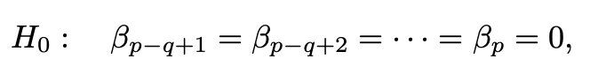

This corresponds to a null hypothesis where for convenience we have put the variables chosen for omission at the end of the list. **In this case we fit a second model that uses all the variables except those last q**.

In essence, the F-test reports the **partial effect** of adding the `q` variable to the model (I think? We'll have to sort this part out a bit more later). For instance, the p-values in the Advertisement example indicate that `TV` and `radio` are related to `sales`, when `TV` and `radio` are held fixed.

Here's the main point they're conveying:

We expect to see approximately five small p-values even in the absence of any true association between the predictors and the response. In fact, it's likely that we will observe at least one p-value below 0.05 by chance! Hence, if we use the individual t-statistics and associated p-values in order to decide whether or not there is any association between the variables and the response, there is a very high chance that will incorrectly conclude that there is a relationship.

HOWEVER, the F-statistic does not suffer from this problem because it adjusts for the number of predictors. Hence, if `H0` is true (no relationship), there is only a 5% chance that the F-statistic will result in a p-value below 0.05, regardless of the number of predictors or the number of observations.

**REMINDER BEFORE WE CONTINUE**: `p` is the number of predictor variables in the regression model.

Anyway... let's continue!

If `p` > `n`, then there are more coefficients `Bj` to estimate than observations from which to estimate them. In this case we cannot even fir the multiple linear regression model using least squares, so the F-statistic cannot be used, and neither can most of the other concepts shown thus far.

**When `p` is large, some of the approaches discussed in the next section, such as **forward selection**, can be used.
## Deciding on Important Variables

As already discussed, the **first step in a multiple regression analysis is to compute the F-statistic and to examine the associated p-value**. Now we need to define which predictors are related to the response. There are three classical approaches for this task:
* **Forward selection**: We begin with the **null model**-a model that contains an intercept but no predictors. We then fit `p` simple linear regressions and add to the null model the variable that results in the lowest RSS. We then add to that model the variable that results in lowest RSS for the new two-variable model. This approach is continued until some stopping rule is satisfied.
* **Backward selection**: We start with all variables in the model, and remove the variable with the largest p-value. The new (p-1)-variable model is fit, and the variable with the largest p-value is removed. This procedure continues until a stopping rule is reached. For instance, we may stop when all remaining variables have a p-value below some threshold.
* **Mixed selection**: This is a combination of forward and backward selection. We start with no variables in the model, and as with forward selection, we add the variable that provides the best fit. We continue to add variables one-by-one. As noted earlier, the p-values for variables can become larger as new predictors are added to the model. Hence, if at any point the p-value for one of the variables in the model rises to above a certain threshold, then we remove that variable from the model. We continue to perform these forward and backward steps until all variables in the model have a sufficiently low p-value, and all variables outside the model would have a large p-value if added to the model.

**Backward selection cannot be used if `p` > `n`, while forward selection can always be used. Forward selection is a greedy approach, and might include variables early that later become redundant. Mixed selection can remedy this.**

## Model Fit

Refer to previous mentions of how R-squared and RSE work to help determine the model's fit. In addition to this usage, it can be useful to plot the data. Graphical summaries can reveal problems with a model that are not visible from numerical statistics (duh).

## Predictions

Once we have fit the multiple regression model, it's straightforward to apply in order to predict the response `Y` on the basis of a set of values for the predictors `X`. However, there are three sorts of uncertainty associated with this prediction.
1. The **least squares plane** is only an estimate for the *true population regression plane*. The inaccuracy in the coefficient estimates is related to the **reducible error** from Chapter 2 (look it up if your so god damn curious). We can compute a confidence interval in order to determine how close `Yhat` will be to f(x).
1. Of course, in practice assuming a linear model is almost always an approximation of reality, so there's an additional source of potentially reducible error which we call **model bias**.
1. Even if we know what f(x) was, the response value cannot be predicted perfectly because of the random error in the model. We use **prediction intervals to answer how much `Y` wil vary from `Yhat`. Prediction intervals are always wider than confidence intervals, because they incorporate both the error in the estimate for f(X) (the reducible error) and the uncertainty as to how much an individual point will differ from the population regression plane (the irreducible error).

## Other Considerations in the Regression Model

### Qualitative Predictors

So far, we've only assumed that the variables in our linear regression model are quantitative. But in practice, we sometimes have to deal with qualitative data as well (no shit).

### Predictors with Only Two Levels

Suppose we want to investigate differences in credit card balance between those who own a house and those who don't (qualitative), ignoring the other variables for a moment. If a qualitative predictor (known as a **factor**) only has two levels, or possible values, then incorporating into a regression model is very simple. We simply create an indicator or **dummy variable** that takes on two possible numerical values. This is simply a `True` or `False` / or 0/1 value. Woah! Who would've guessed it! We're gonna use this variable as a predictor in the regression equation. This results in the following model:

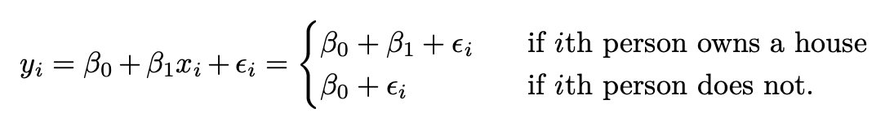

As you might've guessed, the parts in brackets are the binary values. Now 
* `B0` can be interpreted as the average credit card balance among those who do not own.
* `B0` + `B1` as the average credit card balance among those who do own their house.
* And `B1` as the average difference in credit card balance between owners and non-owners.

The following table displays the coefficient estimates and other information associated with the model:

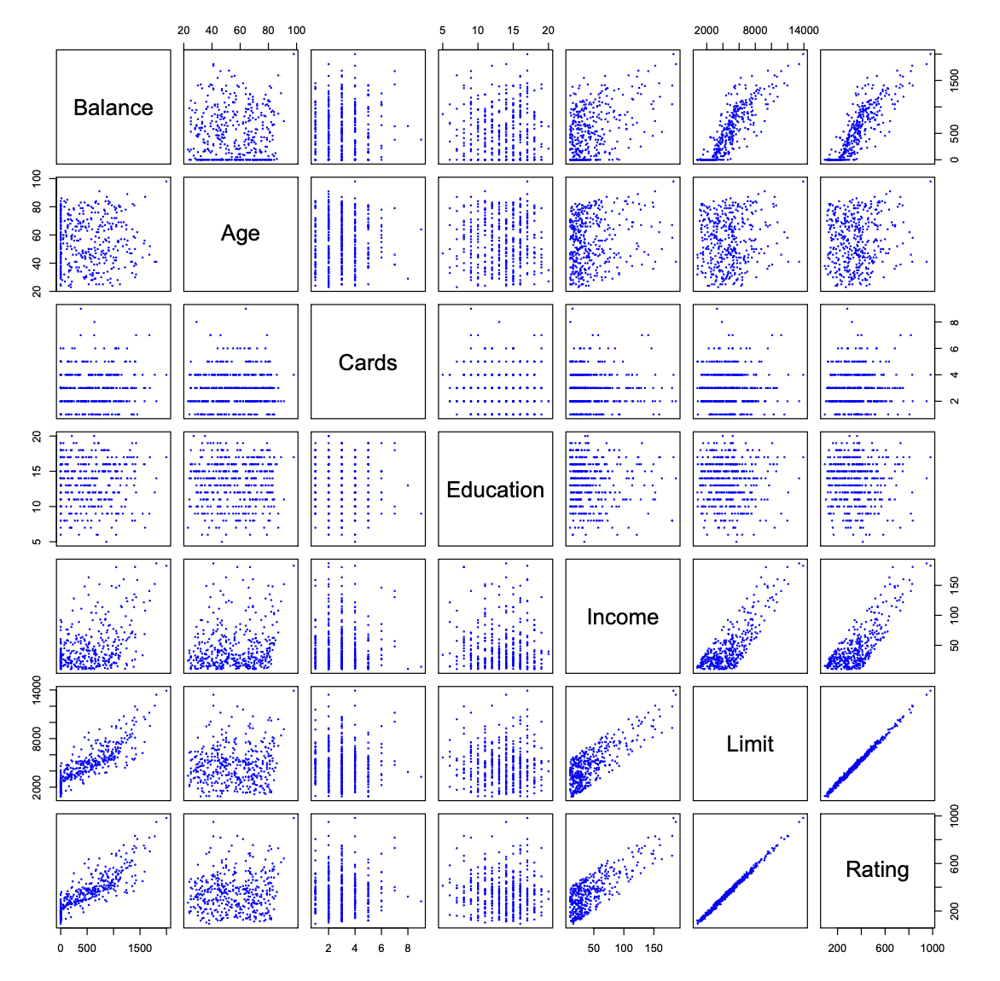

**Notice that the p-value for the dummy variable is very high**. This indicates that there is no statistical evidence of a difference in average credit card balance based on house ownership.

The decision to code owners as 1 and non-owners as 0 is arbitrary, and **has no effect on the regression fit, but does alter the interpretation of the coefficients**. Alternatively, instead of a 0/1 coding scheme, we could create a dummy variable like this:

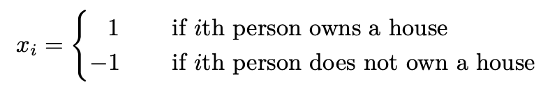

We could then use this variable in the regression equation resulting in this:

~[Alt image](images/alt_dummy_variable_equation.png)

Now `B0` can be interpreted as the overall average credit card balance (ignoring the house ownership effect), and `B1` is the amount by which house owners and non-owners have credit card balances that are above and below the average, respectively. Think about it, the negative and positive values are what enable this scenario to take place!

Keep in mind that the coefficients are interpreted differently in this instance.

### Qualitative Predictors with More than Two Levels

When a qualitative predictor has more than two levels, a single dummy variable cannot represent all possible values. In this situation, we can create additional dummy variables. For example, for the `region` variable we can create two dummy variables. The first could be

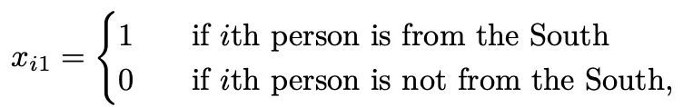

and the second could be

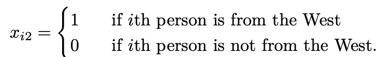

Then both of these variables can be used in the regression equation, in order to obtain the model:

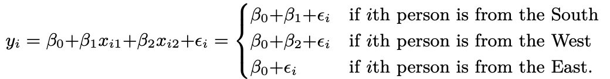

Now
* `B0` can interpreted as the average credit card balance for individuals from the East
* `B1` can be interpreted as the difference in the average balance between people from the South vs. the East
* `B2` can be interpreted as the difference in the average balance between those from the West vs. those from the East.

**There will always be one fewer dummy variable than the number of levels**. The level with no dummy variable-East in this example- is known as the **baseline**.

**Note that the coefficients and their p-values depend on the choice of the dummy variable coding**. Rather than rely on the individual coefficients, we can use an F-test to test the null hypothesis, which doesn't depend on the variable coding.

## Extensions of the Linear Model

The standard linear regression model provides interpretable results and works quite well on many real-world problems. However, it makes several highly restrictive assumptions that are often violated in practice.

**Two of the most important assumptions state that the relationship between the predictors and response are additive and linear**. The additivity assumption means that the association between a predictor `Xj` and the response `Y` does not depend on the values of other predictors. The linearity assumptions states that the change in the response `Y` associated with a one-unit change in `Xj` is constant, regardless of the value of `Xj`. We'll get to methods that address these issues much later.

In the meantime, we'll briefly examine some common classical approaches for extending the linear model.

### Removing the Additive Assumption

Consider the standard linear regression model with two variables:

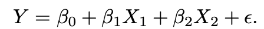

According to this model, a one unit increase in `X1` is associated with an average increase in `Y` of `B1` units. Notice that the presence of `X2` does not alter this statement-that is, regardless of the value of `X2`, a one unit increase in `X1` is associated with a `B1` unit increase in `Y`. 

One way to extend the linear model is to include a third predictor, called an **interaction term**, which is constructed by computing the product of `X1` and `X2`. This results in the model:

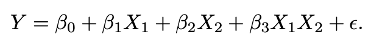

How does this interaction term relax the additive assumption? Notice that the above formula can be rewritten as:

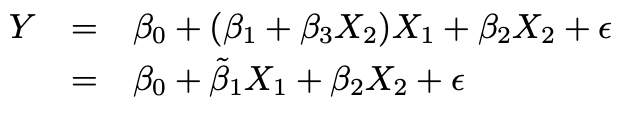

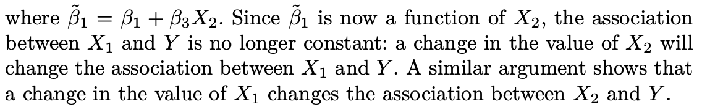

Essentially, the interaction term multiplies two coefficients (features) that are related to one another in order to help alleviate the issue that comes into play when all the variables are otherwise directly scaled to one another.

It is also sometimes the case that an interaction term has a very small p-value, but the associated main effects do not. The **hierarchical principle** states that **if we include an interaction in a model, we should also include the main effects, even if the p-values associated with their coefficients are not significant**.

In other words, if the interaction between `X1` and `X2` seems important, then we should include both `X1` and `X2` in the model even if their coefficient estimates have large p-values.

**Refer to page 106-107 for more details on how this is graphically represented**.

### Non-linear Relationships

Now it's FINALLY time to extend the linear regression model (in a simple way at least) to accommodate non-linear relationships. We'll do this using **polynomial regression**. In later chapters you'll be shown more complex approaches for performing non-linear fits in more general settings.

Consider this graph, which is the `mpg` versus `horsepower` for a number of cars in the `Auto` dataset:

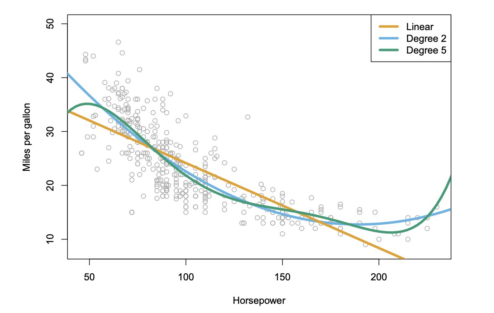

The orange line represents the linear regression fit. There is a pronounced relationship between `mpg` and `horsepower`, but it's clearly not a linear one. Instead, the data suggest a curved relationship.

A simple approach for incorporating non-linear associations in a linear model is to include transformed versions of the predictors. For example, the points in the above graph seem to have a **quadratic shape**, suggesting that a model of the form

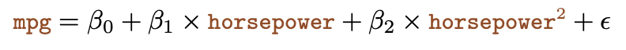

may provide a better fit. This equation involves predicting `mpg` using a non-linear function of `horsepower`... but it is still a linear model!!! Essentially, it's simply a multiple linear regression model with `X1` = `horsepower` and `X2` = `horsepower**2`. So we can use the standard linear regression software to estimate `B0`, `B1`, and `B2` in order to produce a non-linear fit.

The blue curve in the graph shows the resulting quadratic fit to the data. Obviously, it's much better than th linear fit.

If including `horsepower**2` led to such a big improvement in the model, why not include `horsepower**3`, `horsepower**4`, or even `horsepower**5`? The green curve in the graph displays the fit that results from including all polynomials up to the fifth degree in the model. Our textbook homies say that it's unclear that including the additional terms really has led to a better fit to the data.

By the way, this is called **polynomial regression**, since we have included polynomial functions of the predictors in the regression model. We'll further explore this later.

# Potential Problems

When we fit a linear regression model to a particular data set, many problems may occur. Most common among these are the following:
1. Non-linearity of the response-predictor relationships.
1. Correlation of error terms.
1. Non-constant variance of error terms.
1. Outliers.
1. High-leverage points.
1. Collinearity.

In practice, identifying and overcoming these problems is as much an art as a science. Since the linear regression model is not our primary focus here, we will provide only a brief summary of some key points.

## Non-linearity of the Data

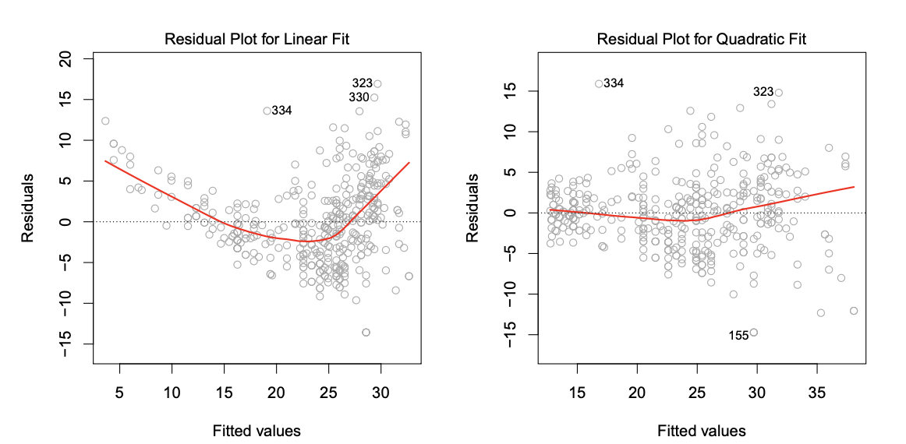

*Plots of residuals versus predicted (or fitted) values for the `Auto` data set. In each plot, the red line is a smooth fit to the residuals, intended to make it easier to identify a trend. Left: A linear regression of `mpg` on `horsepower`. A strong pattern in the residuals indicates non-linearity in the data. Right: A linear regression of `mpg` and `horsepower**2`. There is little pattern in the residuals.

The linear regression model assumes that there is a straight-line relationship between the predictors and the response. If the true relationship is far from linear, then virtually all of the conclusions that we draw from the fit are suspect. In addition, the prediction accuracy of the model can be significantly reduced.

### Residual Plots

**Think of it this way**: residuals are what's left over after your model makes predictions. If there's still a clear pattern in what's left over (left plot), your model missed something important. If what's left over looks like random scatter (right plot), your model got everything.

Think of it like this: if I can look at your residuals and say "when fitted values are low, residuals tend to be positive, and when fitted values are high, residuals tend to be negative" - that's predictable information your model missed.

**Why random residuals are good**:

Random residuals mean you've extracted all the predictable information from your data. There's no systematic relationship left between your predictions and your errors.

**Residual plots** are a useful graphical tool for identifying non-linearity. Given a simple linear regression model, we can plot the residuals, ei = yi− yi, versus the predictor xi. In the case of a multiple regression model, since there are multiple predictors, we instead plot the residuals vs. the predicted (or fitted) values for `y_hati`. Ideally, the residual plot will show no discernible pattern. The presence of a pattern may indicate a problem with some aspect of the linear model.

If the residual plot indicates that there are non-linear associations in the data, then a simple approach is to use non-linear transformations of the predictors, such a `log(X)`, `sqrt(X)`, and `X**2`, in the regression model. We'll get into the more fancy methods much later.

## Correlation of Error Terms

An **important assumption of the linear regression model is that the error terms are uncorrelated. **If there is correlation among the error terms, then the estimated standard errors will tend to underestimate the true standard errors**. As a result, confidence and prediction intervals will be narrower than they should be. For example, a 95% confidence intercal may in reality have a much lower probability than -.95 of containing the true value of the parameter.

Correlations among the error terms frequently occur in the context of **time series data**, which consists of observations for which measurements are obtained at discrete points in time. In many cases, observations that are obtained at adjacent time points will have positively correlated errors.

In order to determine if this is the case for a given data set, we can plot the residuals from our model as a function of time. If the errors are correlated, then there should be no discernable pattern. On the other hand, if the error terms are positively correlated, then we may see **tracking** in the residuals-that is, adjacent residuals may have similar values.

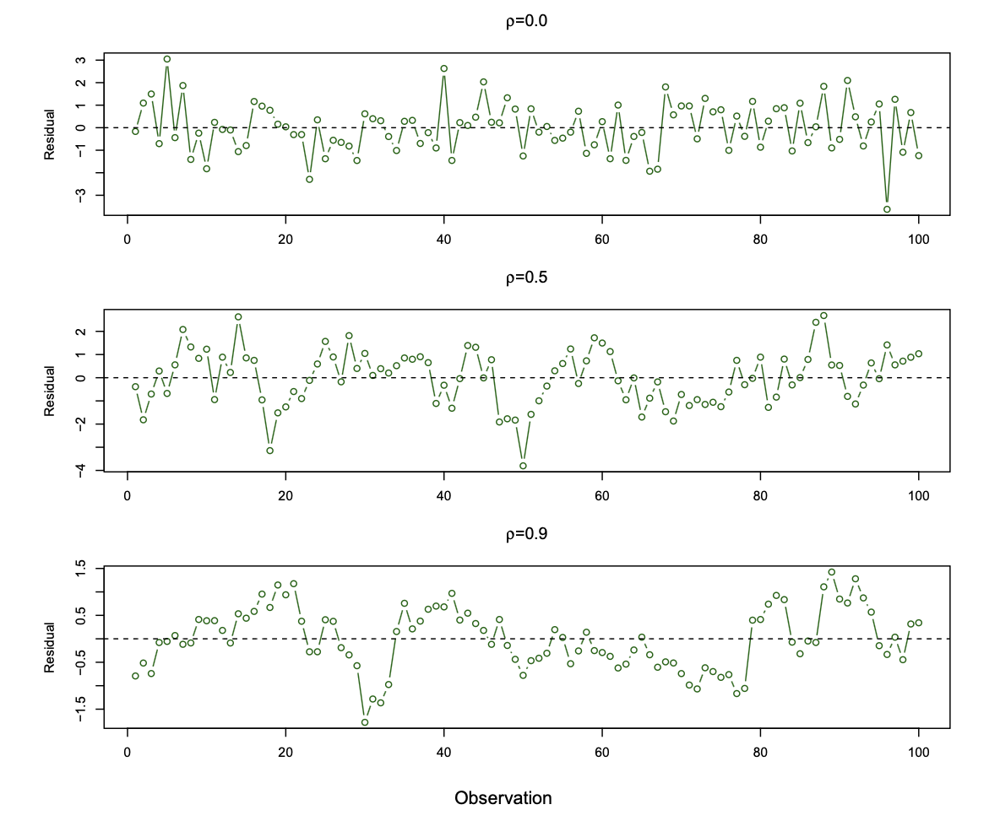

I'm not seeing any pattern in these graphs at all. Looks like random noise to me, but let's just continue. We can alleviate the confusion here by printing the p-value alongside the graphs when actually applying the concept.

Many methods have been developed to properly take account of correlations in the error terms in time series data. Seems like this was kinda a pointless section. Let's continue.

## Non-constant Variance of Error Terms

Another important **assumption of the linear regression model is that error terms have a constant vwariance, Var(ϵi) = σ2. The standard errors, confidence intervals, and hypothesis tests associated with the linear model rely upon this assumption. Obviously (and probably most often), this isn't always true.

For instance, the variances of the error terms may increase with the value of the response. One can identify **non-constant variances in the errors, or heteroscedasticity**, from the presence of a **funnel shape** in the residual plot. Refer to this graph for a visual:

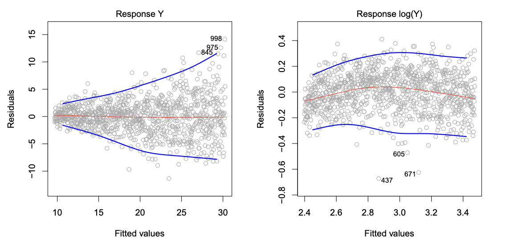

*In each plot, the red line is a smooth fit to the residuals, intended to make it easier to identify a trend. The blue lines track the outer quantiles of the residuals, and emphasize patterns. Left: the funnel shape indicates heteroscedasticity. Right: the response has been log transformed, and there is now no evidence of heteroscedasticity.*

When faced with the problem of heteroscedasticity, one possible solution is to transform the response `Y` using a concave function such as log `Y` of `sqrt(Y)`. Such a transformation results in a greater amount of shrinkage of the larger responses, leading to a reduction in heteroscedasticity. This is the right plot. The residuals now appear to have constant variance, though there is some evidence of a slight non-linear relationship in the data.

## Outliers

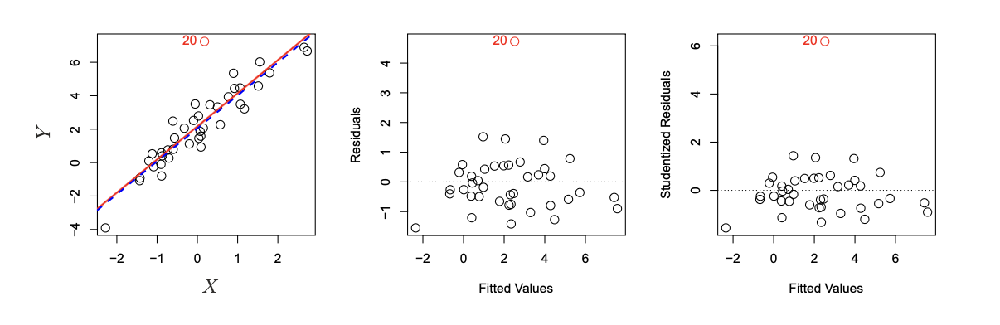

The red point represents the outlier. The red solid line is the least squares regression fit, while the blue dashed line is the least squares fit after removing the outlier.

In this case, removing the outlier clearly has little (almost no) effect. Typically an outlier tends to have little effect on the least squares fir. However, **even if an outlier doesn't have much affect, it can cause other problems**. In this example, the RSE is 1.09 when the outlier is included in the regression, but it's only 0.77 when the outlier is removed. Since the RSE is used to compute all confidence intervals and p-values, such a dramatic increase caused by a single data point can have implications for the interpretation of the fit. Similarly, inclusion of the outlier causes the R squared to decline from 0.892 to 0.805.

Residual plots can be used to identify outliers. In this example, the outlier is very visible, but in practice it can be difficult to decide how large a residual needs to be before we consider it an outlier. To address this problem, instead of plotting the residuals, we can plot the **studentized residuals**, computed by dividing each residual error term of i by its estimated standard error.

Observations whose studentized residuals are greater than 3 in absolute value are possible outliers. In the right hand panel, this values exceeds 6. I'm sure you can draw the correct conclusion from that info.

## High Leverage Points

We just saw that outliers are observations for which the response `yi` is unusual given the predictor `x`. In contrast, observations with **high leverage** have an unusual value for `xi`. For example, observation 41 in the left panel has high leverage

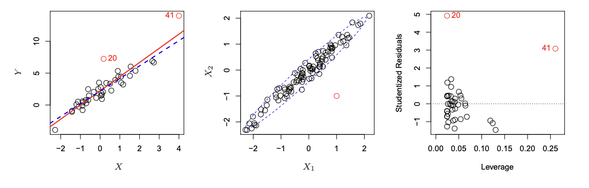

in that the predictor value for this observation is large relative to the other observations. The red solid line is the least squares fit to the data, while the blue dashed line is the fit produced when observation 41 is removed.

Comparing the left-hand panels of the two previous graphs, we observe that removing the high leverage observation has a much more substantial impact on the least squares line than removing the outlier. In fact, **high leverage observations tend to have a sizable impact on the estimated regression line**. It is cause for concern if the least squares line is heavily affected by just a couple of observations, because any problems with these points may invalidate the entire fit.

In multiple linear regression with many predictors, it's possible to have an observation that's well within the range of each individual predictor's values, but that is unusual in terms of the full set of predictors.

Most values in the above graph fall within the blue ellipse, but the red observation is well outside of this range. But neither its value for `X1` nor its value for `X2` is unusual. So if we examine just `X1` or just `X2`, we'll fail to notice this high leverage point.

In order to quantify an observation's leverage, we compute a **leverage statistic**. A large value of this stat indicates an observation with a high leverage. The leverage statistic is always between 1/*n* and 1, and the average leverage for all these observations is always equal to (*p*+1)/n.

## Collinearity

**Collinearity** refers to the situation in which two or more predictor variables are closely related to one another, as shown here:

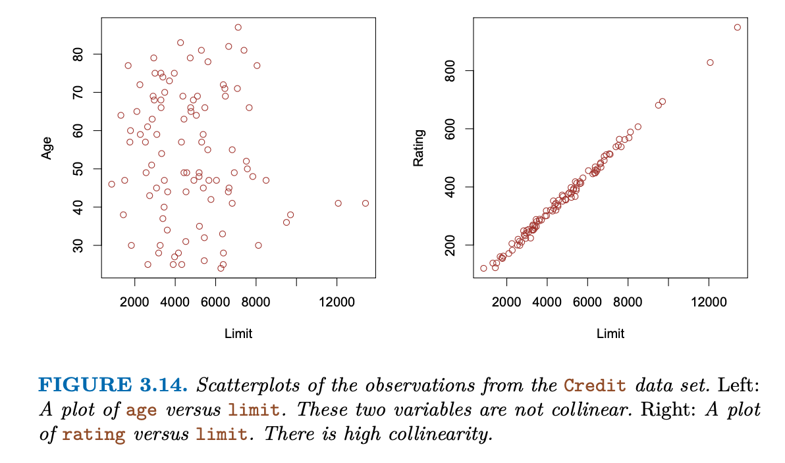

The presence of collinearity can pose problems in the regression context, since it can be difficult to separate out the individual effects of collinear variables on the response. In other words, since `limit` and `rating` tend to increase or decrease together, it can be difficult to determine how each one separately is associated with the response, `balance`.

Below illustrates from of the difficulties that can result from collinearity:

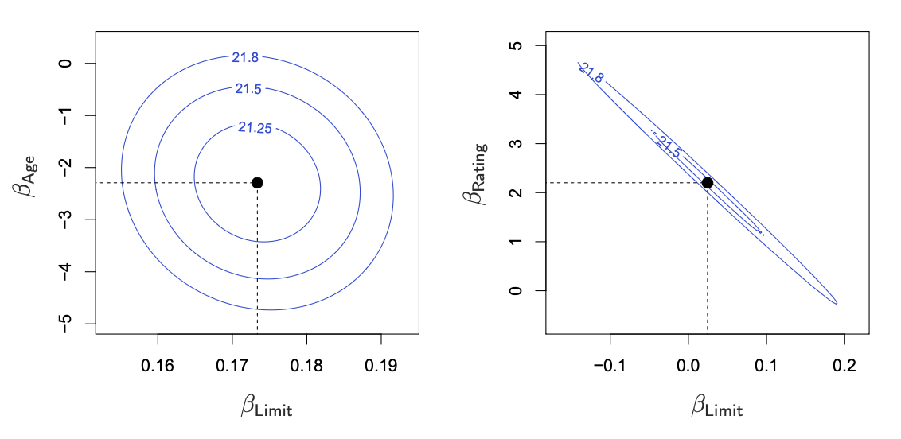

Each ellipse represents a set of coefficients that correspond to the same RSS, with ellipses nearest to the center taking on the lowest values of RSS. The black dots and associated dashed lines represent the coefficient estimates that result in the smallest possible RSS-in other words, these are the least squares estimates. As an example of interpreting the graph, we see that the true `limit` coefficient is almost certainly somewhere between 0.15 and 0.20.

In contrast, the right-handed panel displays contour plots of the RSS associated with possible coefficient estimates for the regression of `balance` onto `limit` and `rating`, which we know to be highly collinear. Now the contours run along a narrow valley; there is a broad range of values for the coefficient estimates that result in equal values for RSS. Hence, a small change in the data could cause the pair of coefficient values that yield the smallest RSS-that is, the least squares estimates-to move anywhere along this valley. This results in a great deal of uncertainty in the coefficient estimates. Notice that the scale for the `limit` coefficient now runs from roughly -0.2 to 0.2; this is an eight-fold increase over the plausible range of the `limit` coefficient in the regression with `age`. 

This collinearity not only reduces the accuracy of the estimates of the regression coefficients, it also causes the standard error for `Bhat_j` to grow.

**A simple way to detect collinearity is to look at the correlation matrix of the predictors:

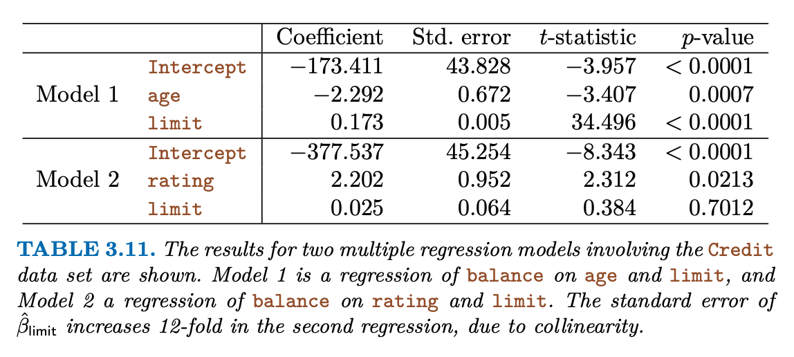

Not all collinearity problems can be detected by inspection of the correlation matrix: it's possible for collinear-
ity to exist between three or more variables even if no pair of variables
has a particularly high correlation. We call this situation **multicollinearity**.

Instead of inspecting th correlation matrix, a better way to asses multicollinearity is to compute the **variance inflation factor (VIF)**. The VIF is the ratio of the variance of `Bhat_j` when fitting the full model divide by the variance of `Bhat_j` if fit on its own.

**The smallest possible value for VIF is 1, which indicates the absence of collinearity. As a rule of thumb, a VIF value that exceeds 5 or 10 indicates a problematic amount of collinearity.**

When faced with the problem of collinearity, there are two simple solutions. The first is the drop one of the problematic variables from the regression. This can usually be done without much compromise to the regression fit since the presence of collinearity implies that the information that this variable provides about the response is redundant in the presence of the other variables.

The second solution is to combine the collinear variables together into a single predictor. For instance, we might take the average of standardized versions of `limit` and `rating` in order to create a new variable that measures credit worthiness.
# Comparison of Linear Regression with K-Nearest Neighbors

Linear regression is an example of a **parametric** approach because it assumes a linear functional form for f(x). Parametric methods have several advantages: They are often easy to fit, because one need estimate only a small number of coefficients.

In the case of linear regression, the coefficients have simple interpretations, and tests of statistical significance can be easily performed. But... parametric methods do have a disadvantage: by construction, they **make strong assumptions about the form of f(x)** (as I'm sure you've noticed).

In contrast, **non-parametric** methods do not explicitly assume a parametric form for f(x), thus providing an alternative and more flexible approach for performing regression.

Here we consider one of the simplest and best-known non-parametric methods, **K-nearest neighbors regression (KNN regression)**.

Given a value for `K` and a prediction point `x0`, KNN regression first identifies the `K` training observations that are closest to `x0`, represented by `N0`. It then estimates (f(x0)) using the average of all the training responses.

**This is a really over sophisticated way of saying "it groups close values together"**. It's a **classification algorithm**. That's all you need to know.

**A quick explanation of KNN**:

In KNN, the K represents the number of nearest neighbors the algorithm considers when making a prediction.

When you want to classify a new data point or predict its value, KNN looks at the K closest training examples in the feature space and uses them to make the decision:
* For classification: KNN takes a majority vote among the neighbors. If K=5 and 3 neighbors are "cat" while 2 are "dog", it predicts "cat".
* For regression: KNN typically averages the values of the K neighbors.

**Choosing K matters**:
* K=1: Very sensitive to noise, can overfit.
* Large K: Smoother decisions but might miss local patterns.
* Odd K values avoid ties in binary classification.

I'll say that last point again, **we typically want to use odd numbers for the K value!**

In general, KNN seems to be more of an introductory clustering formula, and it doesn't seem like you should use it very often in practice. Most notably, it doesn't scale well. It especially struggles with multidimensionality.

The following graph illustrates two KNN fits on a data set with p = 2 predictors:

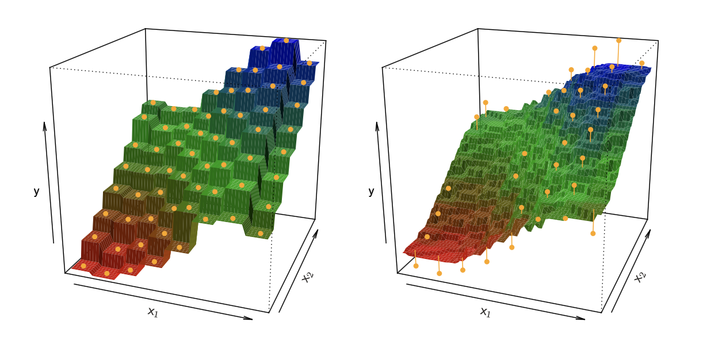

We see that when K=1, the KNN fit still is a step function, but averaging over nine observations results in smaller regions of constant prediction, and consequently a smoother fit. 

In general, **the optimal value for K will depend on the bias-variance tradeoff**. You can learn more about bio variance tradeoff in Chapter 2.

A small value for K provides the most flexible fit, which will have low bias but high variance. This variance is due to the fact that the prediction in a given region is entirely dependent on just one observation. In contrast, larger values of K provide a smoother and less variable fit; the prediction in a region is an average of several points, and so changing one observation has a smaller effect. However, the smoothing may cause bias by masking some of the structure in f(X). We'll look into estimating tet error rates later.

**The parametric approach will outperform the non-parametric approach if the parametric form that has been selected is close to the true form of *f***.

The following graph provides an example with data generated from a one-dimensional linear regression model. The black solid lines represent f(X), while the blue curves correspond the the KNN fits using K=1 and K=9.

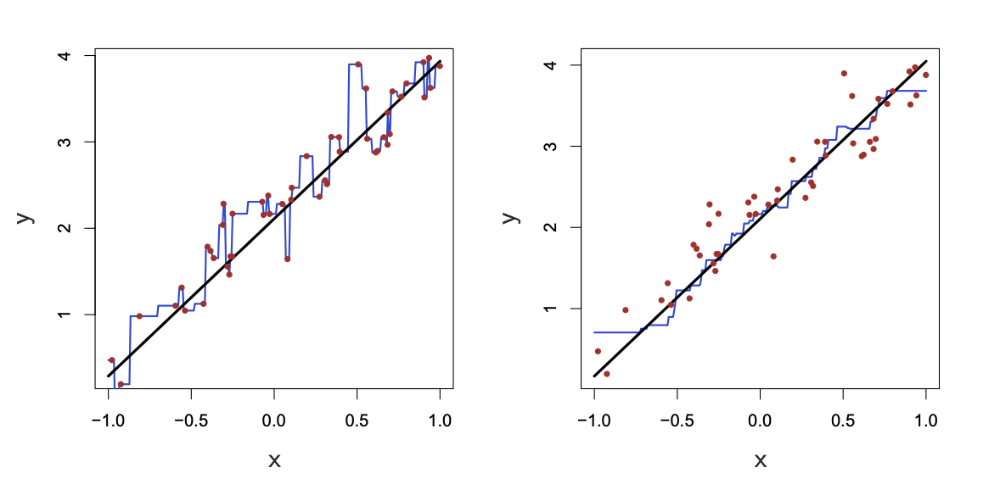

In this case, the K=1 predictions are far too variable, while the smoother K=9 fit is much closer to f(X). However, since the true relationship is linear, it's hard for a non-parametric approach to compete with linear regression: a non-parametric approach incurs a cost in variance that is not offset by a reduction in bias. 

The blue dashed line in the left-hand panel of the following graphs represents the linear regression fit to the same data:

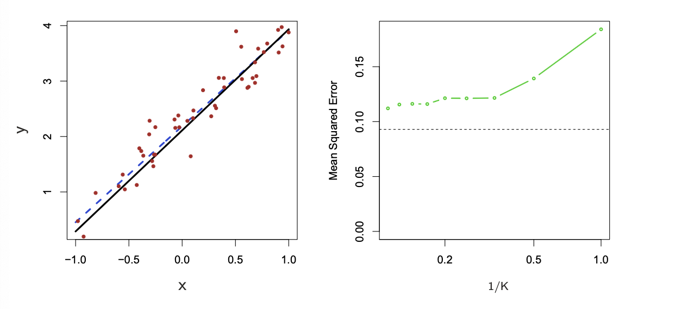

It's almost a perfect fit. The right-hand panel reveals that linear regression outperforms KNN for this data. The green solid line, plotted as a function of 1/K, represents the test set mean squared error (MSE) for KNN. The KNN errors are well above the black dashed line, which is the test MSE for linear regression. When the value of K is large, then KNN performs only a little worse than least squares regression in terms of MSE. It performs far worse when K is small.

The following graphs examine the relative performances of least squares regression and KNN under increasing levels of non-linearity in the relationship between X and Y.

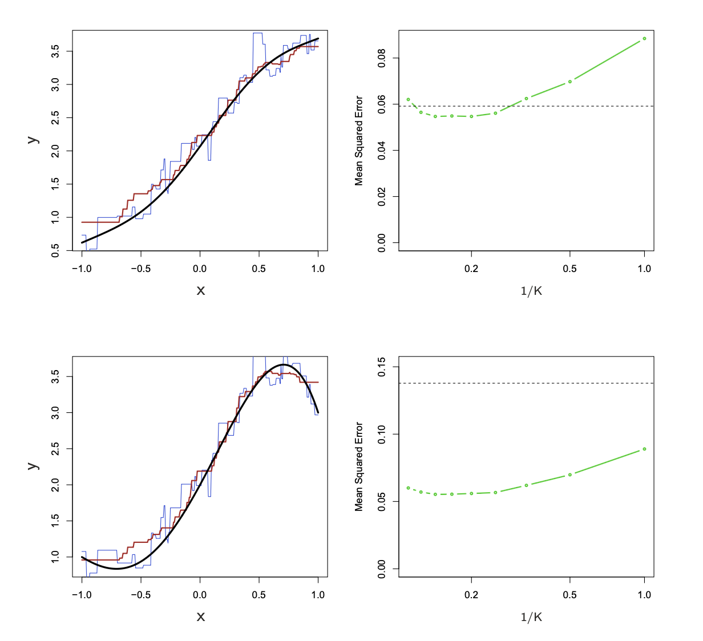

In the top row, the true relationship is nearly linear. In this case we see that the test MSE for linear regression is still superior to that of KNN for low values of K. However, for K>=4, KNN outperforms linear regression.

The second row illustrates a more substantial deviation from linearity. In this situation, KNN substantially outperforms linear regression for all values of K. Note that as the extent of non-linearity increases there is little change in the test set MSE for the non-parametric KNN method, but there is a large increase in the test set MSE for linear regression.

In a real life situation in which the true relationship is unknown, one might suspect that KNN should be favored over linear regression because it will at worst be slightly inferior to linear regression if the true relationship is linear, and may give substantially better results if the true relationship is non-linear. But in reality, even when the true relationship is highly non-linear, KNN may still provide inferior results to linear regression. **This is especially true when p (the number of predictors) is greater, aka when the problem the model is dealing with has higher dimensions**.

Moreover, when p reaches and goes beyond 20, it results in a phenomenon in which a given observation has no nearby neighbors. This is the so-called **curse of dimensionality**. That is, the K observations that are nearest to a given test observation `x0` may be very far away from `x0` in p-dimensional space when p is large, leading to a very poor prediction of f(x0). In other words, if you're dealing with high dimensionality (which is probably most often the case), don't even bother using KNN.

# Key Gaps in Your Understanding

1. The bias-variance tradeoff.
1. Why the F-statistic matters.
1. The curse of dimensionality.
